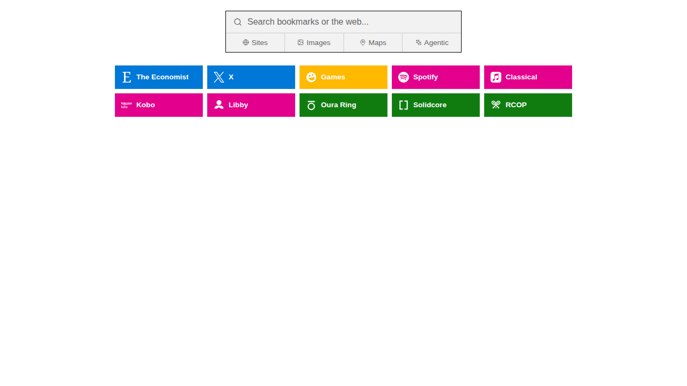

# bradflaugher.com

Source code for [bradflaugher.com](https://bradflaugher.com) — a personal
website hosted on Cloudflare Pages. No build step, no framework, no
backend; every file in this repo is shipped verbatim.

The repo has two pages:

- **[`index.html`](./index.html)** — a static landing page (custom Garamond
  font, gradient background, contact links). Nothing fancy.
- **[`search.html`](./search.html)** — a self-hosted **semantic search
  router** that runs an embedding model entirely in your browser and
  forwards your query to whichever search engine fits best. This is the
  interesting one, and most of this README is about it.

For deep implementation notes, gotchas, and CI details, see
[`AGENTS.md`](./AGENTS.md).

---

## `search.html` — a semantic search router that runs in your browser



Set `https://bradflaugher.com/search?q=%s` as your browser's default
search engine. From then on, every query you type goes through a small
classifier that picks the best destination:

- "lofi beats" → **YouTube**
- "react useEffect cleanup" → **GitHub** *(or Perplexity, depending on phrasing)*
- "integral of x sin(x)" → **Wolfram Alpha**
- "best USB-C cables" → **Amazon**
- "coffee near me" → **Google Maps**
- "github.com" → **direct link**, no engine
- "what is a transformer model" → falls back to **DuckDuckGo**

You don't have to remember which "bang" goes where. You don't even have
to think about it. It just routes.

### Why is this interesting?

Three reasons.

#### 1. It runs the embedding model **in your browser**

There's no API call to OpenAI, no Cloudflare Worker doing inference, no
analytics endpoint logging your queries. The model
([`sentence-transformers/all-MiniLM-L6-v2`](https://huggingface.co/sentence-transformers/all-MiniLM-L6-v2),
22 MB q8-quantized ONNX) is committed to this repository, downloaded once
by your browser, cached forever, and executed on-device via
[`@huggingface/transformers`](https://github.com/huggingface/transformers.js)
v3 (WebGPU/WASM). After the first load, the page works offline and
queries never leave your machine.

It's a useful, fast, real-world ML feature with **zero server cost** and
**zero privacy footprint**. That's worth showing off.

#### 2. The routing logic is layered, not monolithic

The model is the slowest layer, so we only invoke it when faster rules
can't decide. Three layers run in order:

```
                        ┌──────────────┐
input ────────────────→ │ classifyRules │ ── bang or domain match? ──┐
                        └──────────────┘                              │
                              │ no                                    ▼
                              ▼                                  route immediately
                        ┌──────────────┐    score ≥ 0.30    ┌──────────────┐
                        │   classify    │ ─────────────────→ │  best engine │
                        │ (embedding +  │                    └──────────────┘
                        │  dot product) │    score < 0.30   ┌──────────────┐
                        └──────────────┘ ─────────────────→ │  DuckDuckGo  │
                                                            └──────────────┘
```

**Layer 1 — bangs.** DuckDuckGo-style shortcuts. `!yt cats` → YouTube,
`!gh react` → GitHub, `!w sin(x)` → Wolfram, `!a usb-c` → Amazon, etc.
Synchronous, no model needed, never gets it wrong.

**Layer 2 — direct URL detection.** A regex catches things that look like
domains (`github.com`, `news.ycombinator.com`) or `localhost:3000` and
routes them as a literal URL instead of a search.

**Layer 3 — semantic routing.** For everything else, embed the query and
compare against pre-computed embeddings of ~50 example phrases per
engine. Pick the engine with the highest similarity, or fall back to
DuckDuckGo if even the winner is below the confidence threshold.

The scores panel in the bottom-left shows all 9 candidate scores so you
can see exactly *why* the router chose what it chose. It's a debugger
masquerading as a UI element.

#### 3. The embedding-comparison details actually matter

Naive cosine-similarity code is everywhere on the internet, and most of
it is doing more work than necessary.

This page **L2-normalizes both sides at index time and at query time**,
which means the cosine of the angle between two vectors is exactly equal
to their dot product. So we can drop the `sqrt`s entirely:

```js
// search.html — the hot path
function dot(a, b) {
  let s = 0;
  for (let i = 0; i < a.length; i++) s += a[i] * b[i];
  return s;
}
```

Each route stores its example vectors as a `Float32Array` (allocated once
at load time), so a query needs ~461 × 384 ≈ 180 K float multiplications
total — fast enough that we run it on every keystroke (debounced 150 ms)
on the main thread, no Web Worker.

**Per-route score = max dot product over the route's examples** (i.e.,
nearest-neighbor pooling, not mean pooling). This is more robust when
example phrasings vary widely: a query that closely matches *one* example
shouldn't get diluted by 49 unrelated ones.

There's also a sequence-token race fix (`hintSeq`) so that if you type
fast and inferences resolve out of order, the latest keystroke always
wins. The previous version used a boolean lock that silently dropped
keystrokes — a subtle UX regression that took a real test to catch.

### Build/run/serve

There is no build step. The page is a single HTML file with inline CSS
and an ES-module script tag. Static files only.

To preview locally:

```bash
npm ci
npx serve -l 3000 .
# open http://localhost:3000/search.html
```

You need [`serve.json`](./serve.json) on disk so the dev server doesn't
301-redirect `/search.html?q=…` and drop the query string in the
process. Cloudflare Pages preserves it, but `serve` defaults don't.

The first page load downloads the ~22 MB model from the local server;
subsequent loads use the browser cache.

### Tests

A Playwright suite ([`tests/search.spec.ts`](./tests/search.spec.ts))
covers the whole stack:

| Group                          | What it asserts                                                                  |
| ------------------------------ | -------------------------------------------------------------------------------- |
| boot                           | model loads, status indicator reaches `ready`, no console errors                 |
| bang shortcuts                 | each `!x` routes to the right host (encoding-agnostic)                           |
| `?q=` redirect                 | `?q=!yt+lofi` auto-redirects; empty `?q=` stays on the page                      |
| direct URL detection           | domains and `localhost:3000` classify as direct; phrases with spaces don't       |
| semantic routing               | scores panel renders all 9 routes with exactly one `.best`; no stale UI on rapid input |
| cancel button                  | clicking cancel stops the redirect, restores focus, preserves the query          |
| mobile keyboard awareness      | a synthetic `visualViewport` resize lifts the scores panel above the keyboard    |

Run them:

```bash
npx playwright install --with-deps chromium    # one-time
npx playwright test                             # full suite, ~50s
npx playwright test -g "bang"                   # one describe block
npx playwright test -g "cancel" --headed        # watch it run
npx playwright show-report                      # open last HTML report
```

The `webServer` block in [`playwright.config.ts`](./playwright.config.ts)
auto-starts the dev server, so you don't have to.

CI runs the same suite on every PR via
[`.github/workflows/search-tests.yml`](./.github/workflows/search-tests.yml),
caches the Playwright browsers, and uploads the HTML report as an
artifact when something fails.

### Mobile keyboard handling

iOS Safari anchors `position: fixed` to the layout viewport, not the
visual viewport, so the soft keyboard happily covers any
bottom-anchored UI. The page handles this two ways:

1. **`interactive-widget=resizes-content`** in the viewport meta tag —
   modern Chrome and Safari shrink the layout viewport itself when the
   keyboard appears. Free fix where it's supported.
2. **`visualViewport` listener** (the fallback) — JavaScript computes
   the obscured bottom inset and writes it to a `--keyboard-inset` CSS
   variable that `.scores-panel` and `.status-dot` add to their `bottom`
   offset. Works on older iOS too.

### What's in the repo

```
.
├── index.html                       # Landing page (no JS logic)
├── search.html                      # The router (everything described above)
├── search-embeddings.json           # ~3.5 MB of pre-computed L2-normalized vectors
├── search.webmanifest               # PWA manifest
├── models/sentence-transformers/all-MiniLM-L6-v2/
│   ├── config.json, tokenizer*.json, special_tokens_map.json
│   └── onnx/model_quantized.onnx    # 22 MB, q8-quantized
├── tests/search.spec.ts             # Playwright E2E tests
├── playwright.config.ts             # Test runner config
├── serve.json                       # `npx serve` config (cleanUrls: false)
├── _headers                         # Cloudflare Pages cache headers
├── .github/workflows/
│   ├── deploy.yml                   # Cloudflare Pages deploy
│   └── search-tests.yml             # Runs the Playwright suite
├── fonts/                           # Garamond Classico SC for index.html
├── favicon-*.png, og-image*.png     # Static assets
├── AGENTS.md                        # Deep technical notes (start here for big changes)
└── README.md                        # You are here
```

### Updating the embeddings

The example phrases in `search-embeddings.json` are hand-curated — about
50 per route across 9 routes (461 vectors total, 384 dimensions each). To
add or swap examples, regenerate the file with a Python script that
loads `sentence-transformers/all-MiniLM-L6-v2` and calls
`model.encode(phrases, normalize_embeddings=True)`. The output must keep
all vectors L2-normalized, because the runtime relies on
`cos(a, b) ≡ a · b` to skip the `sqrt`s. There's a one-liner sanity check
in [`AGENTS.md`](./AGENTS.md).

---

## `index.html`

A static, single-file landing page. Custom Garamond Classico SC font,
warm-tinted radial gradient background, three blocks of links (contact,
work, location). No JavaScript, no analytics, no tracking. Edit the HTML
in place; there's no build step.

---

## License

Code in this repository is mine. The model weights under `models/` are
[`sentence-transformers/all-MiniLM-L6-v2`](https://huggingface.co/sentence-transformers/all-MiniLM-L6-v2),
released by their authors under Apache 2.0.
